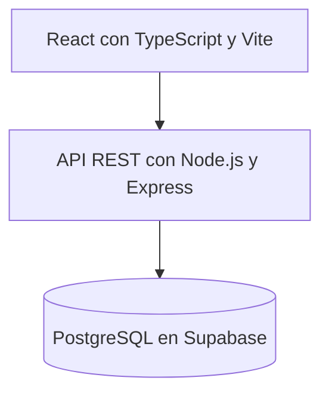
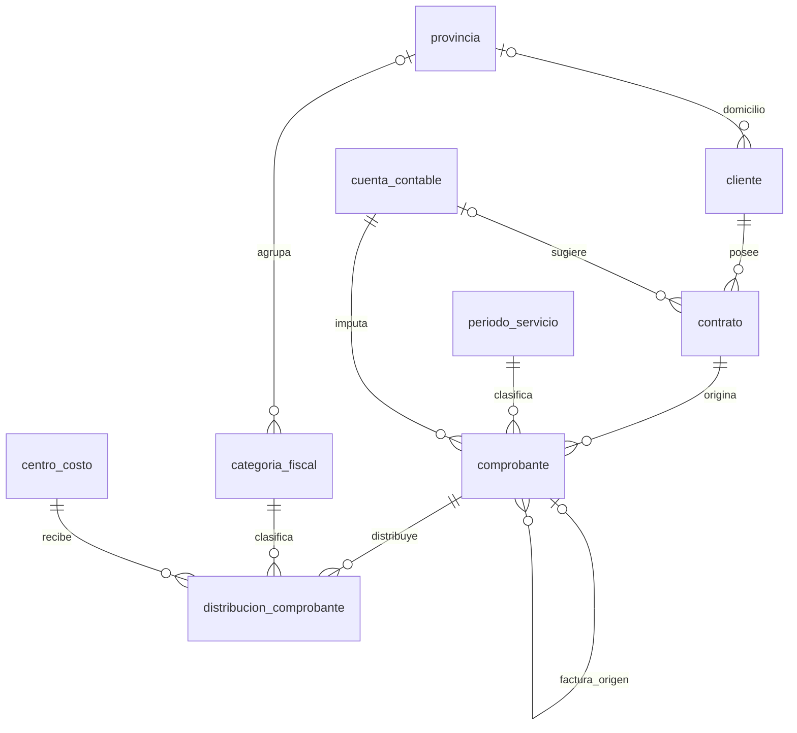

# Sistema Web de Gestión de Facturación y Generación de Información Contable

Documentación del producto mínimo viable y de su base de datos.

Este README presenta el problema, el alcance del sistema, sus requisitos y el modelo de datos vigente. Describe el comportamiento esperado del MVP; no implica que todas las funcionalidades estén implementadas. El estado de desarrollo se detalla al final.

## Contenido

- [Introducción y problemática](#1-introducción-y-problemática)
- [Propuesta y objetivos](#2-propuesta-y-objetivos)
- [Alcance del MVP](#3-alcance-del-mvp)
- [Arquitectura y tecnologías](#4-arquitectura-y-tecnologías)
- [Requisitos funcionales](#5-requisitos-funcionales)
- [Requisitos no funcionales](#6-requisitos-no-funcionales)
- [Reglas de negocio](#7-reglas-de-negocio)
- [Modelo de base de datos](#8-modelo-de-base-de-datos)
- [Diccionario de datos](#9-diccionario-de-datos)
- [Procesos y cálculos](#10-procesos-y-cálculos)
- [Restricciones e índices](#11-restricciones-e-índices)
- [Historias de usuario](#12-historias-de-usuario)
- [Casos de uso](#13-casos-de-uso)
- [Trazabilidad y estado del desarrollo](#14-trazabilidad-y-estado-del-desarrollo)
- [Ampliaciones futuras](#15-ampliaciones-futuras)
- [Glosario](#16-glosario)

## 1 Introducción y problemática

La empresa realiza obras y servicios para distintos clientes mediante contratos y genera facturas periódicamente. Actualmente administra gran parte de esta información en planillas de Excel. Los documentos deben relacionarse con contratos, períodos de servicio, provincias, centros de costo y cuentas contables para elaborar distintos reportes.

Este trabajo requiere clasificaciones, cálculos y controles manuales. El uso de varias planillas dificulta las consultas históricas, genera duplicación y obliga a repetir tareas para producir resultados diferentes.

Además, un período de servicio puede no coincidir con un mes calendario. Por ejemplo, un servicio del **14 de mayo al 14 de junio** puede incluir una factura emitida el **5 de junio**. Esa factura pertenece al servicio seleccionado y también al análisis de Ingresos Brutos de junio por su fecha de emisión.

Por ello, cada comprobante conserva una fecha de emisión y un período de servicio asignado expresamente. Los distintos análisis aplican filtros sobre esos datos, sin duplicar el documento ni guardar un único período de análisis que limite su utilización.

Otra dificultad es reconciliar los importes provinciales con los centros de costo. Conocer los totales de ambas dimensiones por separado no permite determinar su cruce exacto. El sistema registrará cada porción del neto junto con su categoría fiscal y centro de costo en una misma fila.

## 2 Propuesta y objetivos

Se propone una aplicación web que centralice la información de facturación y permita utilizarla para diferentes procesos administrativos, contables y fiscales.

**Objetivo principal:** registrar la información una sola vez y utilizarla para diferentes análisis y reportes.

Los objetivos específicos son:

- Administrar clientes, contratos y los catálogos utilizados para clasificar ingresos.
- Registrar facturas, notas de crédito y notas de débito conservando sus relaciones.
- Distribuir el neto de cada documento por categoría fiscal y centro de costo.
- Distinguir el período de servicio del mes calendario de emisión.
- Controlar diferencias de distribución y datos pendientes antes de generar resultados.
- Consultar importes neteados e impuesto calculado por alícuota.
- Generar resúmenes operativos y exportarlos a Excel.

Los beneficios esperados son reducir tareas repetitivas, evitar duplicación y mejorar la consistencia de consultas históricas. El vínculo entre una nota y su factura permite seguir el ajuste comercial; no equivale a un historial de auditoría de todas las modificaciones.

El proyecto permite aplicar conocimientos de análisis de requisitos, modelado relacional, frontend, backend, APIs REST, validaciones, transacciones y generación de reportes.

## 3 Alcance del MVP

El MVP contempla una empresa emisora, una moneda de trabajo ARS y un único operador administrativo. No incluye gestión de usuarios, roles, permisos de negocio ni auditoría. El operador administra los datos maestros, registra documentos, controla su distribución y consulta los resultados.

El modelo activo contiene nueve tablas y once relaciones mediante claves foráneas. Facturas, notas de crédito y notas de débito se almacenan en comprobante. La tabla distribucion_comprobante identifica el cruce exacto entre categoría fiscal y centro de costo.

### 3.1 Funciones incluidas

- Administración de clientes, contratos, períodos de servicio, cuentas contables, provincias, categorías fiscales y centros de costo.
- Registro de facturas, notas de crédito y notas de débito con neto, IVA y total calculado.
- Distribución del neto por categoría fiscal y centro de costo en una misma operación.
- Gestión de borradores, confirmación y anulación de comprobantes.
- Consultas y resúmenes por emisión, período de servicio, contrato, cuenta, provincia y centro de costo.
- Cálculo simple de impuesto mediante alícuota y exportación de los resultados a Excel.

### 3.2 Funciones excluidas

Quedan fuera del MVP la emisión electrónica oficial de comprobantes, cobranzas y pagos, conciliación bancaria, contabilidad de partida doble, liquidación tributaria integral, retenciones, percepciones, SIRCREB, saldos a favor y distribución municipal. Tampoco se contemplan múltiples empresas o monedas, historial de alícuotas, cierre de períodos, importación automática de la planilla, varias cuentas contables por comprobante ni notas aplicadas a múltiples facturas.

Las categorías pueden identificar actividades o regímenes, pero sus nombres no implementan por sí solos coeficientes ni reglas tributarias especiales. El impuesto del MVP es un cálculo de apoyo a la gestión, con las tasas configuradas por el operador.

## 4 Arquitectura y tecnologías

La solución utilizará una arquitectura cliente-servidor:

- **Frontend:** formularios, tablas, filtros, detalle de comprobantes y presentación de reportes.
- **Backend:** validaciones, reglas de negocio, transacciones, consultas y exportación.
- **Base de datos:** persistencia, claves, restricciones, índices y vistas de apoyo.

El frontend se comunica con la API. Las credenciales privilegiadas de la base permanecen en el servidor y no se incluyen en archivos enviados al navegador. El MVP contempla un único operador sin módulos de autenticación, roles o auditoría; las condiciones de acceso al entorno se establecen en RNF08.

La selección de un análisis consiste en indicar **desde**, **hasta**, tipo de reporte y filtros adicionales. No se persisten entidades PeriodoAnalisis, Asiento o ConceptoContable. Los asientos 7 y 13 y el resumen de Ingresos Brutos se generan mediante consultas.

## 5 Requisitos funcionales

Todos los requisitos siguientes pertenecen al alcance objetivo. Prioridad esencial indica que el requisito es necesario para operar con datos confiables. Prioridad complementaria indica que puede implementarse después del circuito principal sin modificar el modelo.

### RF01 Administrar clientes

Prioridad esencial. El sistema deberá permitir crear, consultar, modificar y desactivar clientes, registrando nombre, identificación fiscal y los datos de contacto disponibles. La provincia del domicilio no determinará la distribución fiscal de sus comprobantes.

Criterio de aceptación: un cliente puede guardarse con nombre y sin datos opcionales; se rechazan nombres vacíos e identificaciones fiscales repetidas cuando estén informadas. Un cliente desactivado conserva sus operaciones históricas y no se ofrece para nuevos contratos.

### RF02 Administrar contratos

Prioridad esencial. El sistema deberá registrar contratos pertenecientes a un cliente, con número, descripción, vigencia opcional y cuenta contable sugerida. Deberá permitir su consulta, modificación y desactivación.

Criterio de aceptación: se rechaza el mismo número para un mismo cliente, pero se admite para clientes distintos. Si se informa fecha de fin, deberá existir fecha de inicio y no ser posterior al fin. Desactivar un contrato impide seleccionarlo en nuevas cargas, sin ocultar sus comprobantes.

### RF03 Administrar períodos de servicio

Prioridad esencial. El sistema deberá crear y consultar períodos identificados por nombre, inicio y fin inclusivos. Cada comprobante se asignará expresamente a un período; la asignación no se deducirá de su fecha de emisión.

Criterio de aceptación: se rechaza un fin anterior al inicio. Un documento emitido en junio puede corresponder a un servicio de mayo. Si dos períodos comparten una fecha, el operador debe seleccionar el período correspondiente.

### RF04 Administrar cuentas contables y centros de costo

Prioridad esencial. El sistema deberá permitir crear, consultar, modificar y desactivar cuentas y centros, conservando sus códigos como texto. La cuenta del contrato será una sugerencia y la del comprobante será la cuenta efectiva.

Criterio de aceptación: no se admiten códigos duplicados dentro de cada catálogo; se conservan ceros iniciales y puntos. Cambiar la cuenta sugerida de un contrato no cambia documentos existentes. Un centro podrá recibir importes de distintas provincias.

### RF05 Administrar provincias y categorías fiscales

Prioridad esencial. El sistema deberá mantener provincias y categorías, indicando nombre, condición imponible y alícuota. Una categoría imponible deberá pertenecer a una provincia; una categoría no imponible podrá tener provincia o ser global.

Criterio de aceptación: una tasa de 5 % se almacena como 0,05 y se muestra como porcentaje. Se rechazan valores fuera de 0 a 1. Una tasa faltante puede guardarse como configuración pendiente, pero deberá impedir el informe tributario del alcance afectado. Un cambio de tasa debe advertir que modifica los informes históricos recalculados.

### RF06 Registrar facturas

Prioridad esencial. El sistema deberá registrar número completo, fecha real de emisión, contrato, período de servicio, cuenta efectiva, descripción opcional, neto e IVA. El cliente se obtendrá del contrato y el total se calculará como neto más IVA.

Criterio de aceptación: el documento se guarda inicialmente como BORRADOR; no admite importes negativos ni repetición de tipo y número. No puede vincular una factura de origen. Un IVA desconocido no se convierte automáticamente en cero. Incluso un borrador debe cumplir los campos obligatorios de la base.

### RF07 Registrar notas de crédito y débito

Prioridad esencial. El sistema deberá registrar NC y ND vinculadas a una única factura confirmada, con motivo obligatorio y el mismo contrato y cuenta efectiva que la factura de origen para este MVP. Cada nota tendrá su propia fecha de emisión, período y distribución.

Criterio de aceptación: no se admite como origen otra nota, una factura anulada o el propio documento. El neto y el IVA se guardan como magnitudes positivas; la NC resta y la ND suma al consultar. Las NC confirmadas acumuladas no deberán superar el neto ni el IVA de la factura de origen, controlados por separado. Una ND no amplía automáticamente ese límite en el MVP.

### RF08 Distribuir el importe neto

Prioridad esencial. El sistema deberá permitir asignar cada porción del neto a una combinación de categoría fiscal y centro de costo. Deberá mostrar neto del documento, neto distribuido y diferencia pendiente.

Criterio de aceptación: se rechazan filas con importe cero o negativo y destinos repetidos dentro del mismo comprobante. Para confirmar, la suma de las filas debe ser exactamente igual al neto. No se distribuye el IVA ni se deduce un cruce provincial a partir de totales independientes.

### RF09 Confirmar comprobantes

Prioridad esencial. El sistema deberá confirmar un borrador únicamente cuando sus datos y distribución sean válidos. La validación y el cambio de estado deberán ejecutarse en una misma transacción.

Criterio de aceptación: se rechaza una confirmación sin distribución, con diferencia, neto cero u origen inválido. Para notas se verifica también el límite de crédito. Una tasa faltante no impide registrar o confirmar un documento correctamente distribuido, pero permanece señalada y bloquea su cálculo tributario.

### RF10 Corregir y anular comprobantes

Prioridad esencial. El sistema deberá permitir editar borradores y anular documentos conservando su información. Como regla operativa propuesta, un confirmado no se editará directamente: las correcciones se resolverán mediante anulación o una nota, según corresponda.

Criterio de aceptación: los anulados se conservan para consulta y quedan fuera de los totales. No se permite anular una factura que tenga notas confirmadas vigentes; primero debe resolverse ese vínculo. No se habilita reactivar documentos anulados en el circuito básico. Estas transiciones requieren implementación en el backend.

### RF11 Consultar y filtrar comprobantes

Prioridad esencial. El sistema deberá listar comprobantes y permitir búsqueda por número, cliente o contrato y filtros por tipo, estado, fechas de emisión, período y cuenta. Deberá mostrar su detalle, importes y distribución.

Criterio de aceptación: los filtros se combinan, las fechas límite se incluyen y existe un estado visible cuando no hay resultados. El rango corresponde a fechas de emisión; un rango numérico de facturas no forma parte del modelo actual porque numero es texto.

### RF12 Consultar el cruce provincial y por centro de costo

Prioridad esencial. El sistema deberá filtrar simultáneamente provincia y centro de costo dentro de un intervalo de emisión, y presentar importes de las filas que satisfagan ambas condiciones.

Criterio de aceptación: al seleccionar Buenos Aires y un centro, no se suman otras provincias de ese centro ni otros centros de Buenos Aires. El total provincial debe coincidir con la suma de sus cruces y el total por centro con la suma de sus categorías. Las categorías globales sin provincia se presentan como Sin provincia, sin asignarles una jurisdicción ficticia.

### RF13 Calcular importes neteados e impuesto

Prioridad esencial. El sistema deberá sumar facturas y ND y restar NC confirmadas. El impuesto se calculará por fila de distribución aplicando su alícuota al neto, con redondeo a dos decimales antes de sumar. Las categorías no imponibles aportarán impuesto cero.

Criterio de aceptación: un neto de 1.000 con tasa de 0,05 produce impuesto 50; una NC por 200 en el mismo destino produce neto firmado −200 e impuesto −10. El resumen es neto 800 e impuesto 40. Si se muestra neto menos impuesto, será 760 y se identificará como resultado analítico, independiente del total del comprobante con IVA.

### RF14 Controlar la integridad de los informes

Prioridad esencial. Antes de emitir un informe tributario o exportarlo, el sistema deberá identificar comprobantes confirmados con distribución incompleta o tasas imponibles faltantes en el intervalo de emisión solicitado.

Criterio de aceptación: si existe una incidencia en ese intervalo, se informa qué documento debe corregirse y se bloquea el informe tributario, sin mostrar un total parcial como definitivo. El bloqueo se verifica antes de aplicar los filtros provinciales y por centro, según la consulta de control vigente. Un listado administrativo puede seguir mostrando los datos pendientes.

### RF15 Obtener resúmenes temporales y contables

Prioridad esencial. El sistema deberá distinguir el período del servicio de la fecha de emisión. Permitirá obtener resúmenes por contrato, cuenta, período y mes calendario de emisión, usando documentos confirmados.

Criterio de aceptación: un documento de servicio de mayo emitido en junio aparece en el análisis de ese servicio y en el mes de emisión de junio, sin duplicarse dentro de un mismo resumen. Las agrupaciones operativas 7 y 13 deberán mostrar los límites de fechas utilizados; no prorratearán importes por días. Para períodos que excedan los dos meses previstos se requerirá definir el criterio antes de habilitar ese resumen.

### RF16 Exportar resultados

Prioridad complementaria. El sistema deberá exportar a Excel el listado o resumen consultado, indicando filtros, fechas, columnas monetarias y totales. El informe tributario incluirá neto firmado, alícuota e impuesto según el nivel de detalle seleccionado.

Criterio de aceptación: la exportación coincide con la pantalla para los mismos filtros y conserva números como valores numéricos. Si un resumen agrupa categorías con distintas tasas, no se presenta una única alícuota como si fuera común. El control RF14 también se aplica a la exportación tributaria.

## 6 Requisitos no funcionales

Los siguientes criterios son objetivos de aceptación del MVP. Los valores de rendimiento y recuperación se proponen para planificar pruebas y no representan resultados ya medidos ni prestaciones contratadas.

### RNF01 Integridad y atomicidad

La base deberá mantener claves primarias, foráneas, unicidad y restricciones de dominio. La creación de un comprobante con sus distribuciones, su confirmación y la validación de notas deberán completarse o revertirse íntegramente. Verificación: provocar un error durante cada operación y comprobar que no quedan cambios parciales.

### RNF02 Precisión monetaria

Los cálculos persistidos deberán utilizar decimales exactos y dos decimales para dinero; el frontend deberá evitar errores de coma flotante mediante centavos enteros o una biblioteca decimal. Verificación: casos con NC, importes fraccionarios y redondeo por fila producen los mismos resultados en interfaz y SQL, sin diferencias de centavos.

### RNF03 Consistencia ante concurrencia

Aunque exista un operador, dos pestañas o solicitudes simultáneas no deberán permitir superar límites de crédito ni confirmar una distribución que cambió durante el control. Verificación: ejecutar solicitudes concurrentes y comprobar que la transacción, bloqueo o mecanismo equivalente conserva las reglas.

### RNF04 Rendimiento

Objetivo propuesto: con 10.000 comprobantes y 50.000 distribuciones, una sesión activa y un entorno de prueba documentado, el percentil 95 de búsquedas paginadas e informes habituales deberá ser inferior a 2 segundos. Verificación: al menos 30 ejecuciones por operación, registrando volumen, servidor, red y tiempo hasta presentar el resultado. La interfaz deberá paginar y evitar descargar toda la base.

### RNF05 Usabilidad y prevención de errores

Los formularios deberán identificar campos obligatorios, expresar errores junto al dato y conservar la carga si una validación falla. Deberán distinguir visual y textualmente tipo, estado, diferencia pendiente y tasa faltante. Verificación: completar una factura y una NC mediante un recorrido de aceptación sin interpretar nombres internos de tablas.

### RNF06 Accesibilidad y adaptación

Las funciones principales deberán poder utilizarse con teclado, etiquetas accesibles, foco visible y mensajes que no dependan solamente del color. La vista deberá funcionar en anchos de 390 y 1366 píxeles; una tabla podrá tener desplazamiento horizontal controlado. Verificación: recorrer búsqueda, filtros, formulario y detalle con teclado y revisar contraste y ausencia de controles inaccesibles.

### RNF07 Compatibilidad

La aplicación deberá funcionar en Chrome y Edge en las versiones registradas al realizar las pruebas de aceptación. Se documentarán navegador y sistema operativo utilizados. Verificación: completar el circuito principal y comprobar fechas, decimales, diálogos y descarga de archivos en ambos navegadores.

### RNF08 Protección técnica de los datos

El MVP no tendrá módulos de usuarios, roles ni auditoría, pero las credenciales privilegiadas deberán permanecer en el servidor. La clave publicable no equivale a una credencial administrativa. Las tablas conservarán RLS y no se abrirán políticas públicas de escritura para conectar el frontend. Una instalación sin autenticación se limitará a un entorno local o acceso restringido; publicar un backend privilegiado de acceso libre queda fuera de esta configuración.

Verificación: revisar que los archivos del navegador no contienen secretos y que una solicitud pública no autorizada no puede leer ni modificar datos. Si se publica el servicio, deberá utilizar transporte cifrado y definirse el control de acceso de infraestructura antes de su exposición. Esto no agrega tablas de permisos al modelo.

### RNF09 Validación de entradas

El backend deberá validar tipos, longitudes, valores permitidos, referencias y reglas de negocio independientemente de la interfaz. Las consultas deberán usar parámetros. Verificación: enviar directamente solicitudes inválidas y comprobar su rechazo sin corrupción ni exposición de información interna.

### RNF10 Recuperación

Objetivo propuesto: contar con una copia recuperable diaria y poder restaurar en hasta 4 horas, con una pérdida máxima de 24 horas de datos. Verificación: restaurar una copia en un entorno separado y contrastar cantidades, totales y relaciones. La disponibilidad de copias en Supabase deberá comprobarse según la configuración elegida; no se presupone que estén habilitadas.

### RNF11 Mantenibilidad y evolución

El código deberá separar presentación, reglas de negocio y acceso a datos. Los cambios del modelo deberán mantener actualizado el diccionario de datos. Verificación: la estructura implementada coincide con la documentación y las reglas críticas disponen de pruebas reproducibles.

### RNF12 Manejo de fallos y trazabilidad de resultados

La aplicación deberá distinguir ausencia de datos, informe bloqueado y error de conexión. Los informes y exportaciones deberán indicar sus filtros, fechas y criterio de cálculo. Verificación: interrumpir el acceso a datos y comprobar que no se muestra cero como si fuera un resultado válido. Esta trazabilidad de consultas no constituye un módulo de auditoría de usuarios.

## 7 Reglas de negocio

| Código | Regla | Control previsto |
|---|---|---|
| RN01 | Una empresa emisora y moneda ARS; no hay conversión monetaria. | Alcance de aplicación |
| RN02 | Una factura pertenece a un contrato, período y cuenta efectiva. | NOT NULL y FK |
| RN03 | El número completo es único por tipo; se normaliza antes de guardar. | UNIQUE y backend |
| RN04 | Los importes se guardan positivos o cero; el neto confirmado es mayor que cero. | CHECK |
| RN05 | FACTURA no tiene origen; NC y ND tienen origen y motivo. | CHECK; validez del origen en backend |
| RN06 | NC resta; factura y ND suman. Solo confirmados integran informes. | Vistas y filtros de consulta |
| RN07 | Cada distribución es positiva y única por documento, categoría y centro. | CHECK y UNIQUE |
| RN08 | La suma distribuida coincide con el neto al confirmar. | Backend transaccional; vista de control |
| RN09 | Las NC confirmadas no superan neto ni IVA de la factura de origen. | Backend transaccional |
| RN10 | Imponible exige provincia; tasa entre 0 y 1 si está informada. | CHECK |
| RN11 | Falta de alícuota imponible bloquea el informe tributario; no imponible calcula cero. | Vistas y servicio de informes |
| RN12 | Las fechas de emisión no determinan el período de servicio. | Selección explícita y FK |
| RN13 | Los datos referenciados no se eliminan; los catálogos con activo pueden desactivarse. | FK RESTRICT y backend |
| RN14 | Cambiar la tasa actual modifica cálculos históricos; no existe historial. | Limitación del modelo y aviso de interfaz |

Las restricciones entre varias filas o tablas no están garantizadas por un CHECK local. Deben implementarse en el backend con transacciones o, alternativamente, mediante funciones y disparadores SQL. Las vistas existentes sirven para calcular o detectar incidencias; por sí solas no impiden una escritura inválida.

## 8 Modelo de base de datos

### 8.1 Tecnología y convenciones

El diseño utiliza PostgreSQL en Supabase, esquema public y nombres en snake_case. Cada tabla tiene una clave primaria id de tipo bigint generada por identidad. Los importes monetarios utilizan numeric para preservar precisión; las fechas de negocio se almacenan como date, sin hora. Los códigos e identificaciones se guardan como texto para conservar su formato.

El sistema evita repetir el cliente en comprobante porque se obtiene desde contrato. La provincia de una distribución se obtiene desde categoria_fiscal. La cuenta sugerida del contrato y la cuenta efectiva del documento tienen significados distintos. El total del comprobante es una columna generada, por lo que no se mantiene manualmente una segunda suma.

### 8.2 Entidades y responsabilidades

| Tabla | Responsabilidad |
|---|---|
| cliente | Titular de los contratos y sus datos de contacto. |
| contrato | Servicio o vínculo comercial que origina comprobantes. |
| periodo_servicio | Intervalo operativo al que se asigna el servicio facturado. |
| cuenta_contable | Clasificación contable de los ingresos. |
| comprobante | Cabecera de facturas, NC y ND, importes y estado. |
| provincia | Jurisdicción geográfica, incluyendo CABA. |
| categoria_fiscal | Clasificación del ingreso, provincia y alícuota. |
| centro_costo | Destino de gestión para distribuir los ingresos. |
| distribucion_comprobante | Importe asignado al cruce categoría fiscal y centro. |

### 8.3 Relaciones y cardinalidades

En la columna Participación se indica cuántos padres puede tener cada registro hijo. Cada padre puede tener cero o muchos hijos en todas estas relaciones.

| Padre | Hijo y clave foránea | Participación del hijo |
|---|---|---|
| provincia | cliente.provincia_id | Cero o una provincia de domicilio |
| cliente | contrato.cliente_id | Exactamente un cliente |
| cuenta_contable | contrato.cuenta_contable_id | Cero o una cuenta sugerida |
| contrato | comprobante.contrato_id | Exactamente un contrato |
| periodo_servicio | comprobante.periodo_servicio_id | Exactamente un período |
| cuenta_contable | comprobante.cuenta_contable_id | Exactamente una cuenta efectiva |
| comprobante | comprobante.factura_origen_id | Ninguna para factura; una para NC o ND |
| provincia | categoria_fiscal.provincia_id | Una si es imponible; opcional en caso contrario |
| comprobante | distribucion_comprobante.comprobante_id | Exactamente un comprobante |
| categoria_fiscal | distribucion_comprobante.categoria_fiscal_id | Exactamente una categoría |
| centro_costo | distribucion_comprobante.centro_costo_id | Exactamente un centro |

Un borrador puede tener cero distribuciones, pero un confirmado deberá tener al menos una y distribuir todo su neto. La autorrelación de comprobante representa las notas que afectan una factura, no una tabla adicional. Todas las claves foráneas utilizan ON DELETE RESTRICT y no tienen propagación de borrado.

### 8.4 Diagrama de relaciones

La opcionalidad del diagrama refleja las columnas del esquema. Las reglas condicionales exigen origen en NC y ND, provincia en categorías imponibles y al menos una distribución completa al confirmar. Las nueve entidades representadas son tablas; los informes se calculan y no son entidades adicionales.

## 9 Diccionario de datos

Convenciones: PK significa clave primaria, FK clave foránea y UQ unicidad. Obligatorio se refiere al almacenamiento; las reglas condicionales se detallan en las observaciones. Todos los id son bigint, obligatorios, PK y GENERATED BY DEFAULT AS IDENTITY. Los campos opcionales admiten NULL y no tienen valor predeterminado salvo indicación expresa. Las columnas monetarias no tienen un cero predeterminado.

### 9.1 cliente

| Campo | Tipo SQL | Obligatorio | Significado y restricciones |
|---|---|---|---|
| id | bigint | Sí | PK; identidad automática. |
| razon_social | varchar(200) | No | Denominacion legal opcional; nombre conserva el nombre visible. |
| telefono | varchar(40) | No | Teléfono de contacto. |
| domicilio | text | No | Domicilio de contacto. |
| email | varchar(254) | No | Correo de contacto; formato validado por aplicación. |
| provincia_id | bigint | No | FK a provincia.id. Domicilio, independiente del reparto fiscal. |
| nombre | varchar(200) | Sí | Nombre o razón social. |
| identificacion_fiscal | varchar(30) | No | UQ. CUIT u otra identificación; completar cuando se conozca. |
| activo | boolean | Sí | Disponible para nuevas cargas. Predeterminado true; la desactivación conserva referencias. |

### 9.2 contrato

| Campo | Tipo SQL | Obligatorio | Significado y restricciones |
|---|---|---|---|
| id | bigint | Sí | PK; identidad automática. |
| fecha_inicio | date | No | Inicio opcional de vigencia. |
| fecha_fin | date | No | Si existe fin, exige inicio y fin >= inicio. |
| cuenta_contable_id | bigint | No | FK a cuenta_contable.id. Cuenta sugerida; el comprobante conserva la cuenta efectiva. |
| cliente_id | bigint | Sí | FK a cliente.id. Cliente titular. |
| numero | varchar(80) | Sí | Código de contrato. |
| descripcion | text | No | Objeto o servicio. |
| activo | boolean | Sí | Disponible para nuevas cargas. Predeterminado true; la desactivación conserva referencias. |

### 9.3 periodo_servicio

| Campo | Tipo SQL | Obligatorio | Significado y restricciones |
|---|---|---|---|
| id | bigint | Sí | PK; identidad automática. |
| nombre | varchar(80) | Sí | Ejemplo: Servicio mayo 2026. |
| fecha_inicio | date | Sí | Inicio inclusivo. |
| fecha_fin | date | Sí | Fin inclusivo. |

### 9.4 cuenta_contable

| Campo | Tipo SQL | Obligatorio | Significado y restricciones |
|---|---|---|---|
| id | bigint | Sí | PK; identidad automática. |
| codigo | varchar(40) | Sí | UQ. Código como texto, conservando puntos y ceros. |
| nombre | varchar(150) | Sí | Descripción. |
| activo | boolean | Sí | Disponible. Predeterminado true; la desactivación conserva referencias. |

### 9.5 comprobante

| Campo | Tipo SQL | Obligatorio | Significado y restricciones |
|---|---|---|---|
| id | bigint | Sí | PK; identidad automática. |
| importe_total | numeric(21,2) | Generado | Columna generada en SQL: importe_neto + importe_iva. No editable. No se ingresa; neto e IVA son obligatorios. |
| tipo | varchar(20) | Sí | FACTURA, NOTA_CREDITO o NOTA_DEBITO. |
| numero | varchar(80) | Sí | Identificador completo, normalizado, con punto de venta y letra si corresponde. |
| fecha_emision | date | Sí | Fecha real del documento. |
| contrato_id | bigint | Sí | FK a contrato.id. Contrato; el cliente se obtiene desde él. |
| periodo_servicio_id | bigint | Sí | FK a periodo_servicio.id. Ciclo operativo. |
| cuenta_contable_id | bigint | Sí | FK a cuenta_contable.id. Cuenta de ingreso. |
| factura_origen_id | bigint | No | FK a comprobante.id. Factura afectada por una NC o ND. Obligatorio en NC y ND; NULL en FACTURA; distinto del propio id. |
| descripcion | text | No | Concepto libre del documento; motivo de la NC o ND. Obligatorio y no vacío en NC y ND. |
| importe_neto | numeric(20,2) | Sí | Neto positivo, sin IVA. CHECK >= 0; > 0 si CONFIRMADO. |
| importe_iva | numeric(20,2) | Sí | IVA documentado, cero cuando corresponda. CHECK >= 0; sin valor predeterminado. |
| estado | varchar(20) | Sí | BORRADOR, CONFIRMADO o ANULADO. Predeterminado BORRADOR. |

### 9.6 provincia

| Campo | Tipo SQL | Obligatorio | Significado y restricciones |
|---|---|---|---|
| id | bigint | Sí | PK; identidad automática. |
| nombre | varchar(100) | Sí | UQ. Nombre normalizado. |

### 9.7 categoria_fiscal

| Campo | Tipo SQL | Obligatorio | Significado y restricciones |
|---|---|---|---|
| id | bigint | Sí | PK; identidad automática. |
| provincia_id | bigint | No | FK a provincia.id. Obligatoria para categorías imponibles; opcional para No imponible global. |
| nombre | varchar(120) | Sí | UQ. Ej.: Buenos Aires, Buenos Aires Art.2, CABA obras, No imponible. |
| imponible | boolean | Sí | Indica si genera impuesto en el cálculo simple. Predeterminado true. |
| alicuota | numeric(9,6) | No | Fracción: 0.05 equivale a 5%; NULL si no aplica o falta configurar. |

### 9.8 centro_costo

| Campo | Tipo SQL | Obligatorio | Significado y restricciones |
|---|---|---|---|
| id | bigint | Sí | PK; identidad automática. |
| codigo | varchar(30) | Sí | UQ. Código como texto. |
| nombre | varchar(150) | Sí | Nombre del centro. |
| activo | boolean | Sí | Disponible. Predeterminado true; la desactivación conserva referencias. |

### 9.9 distribucion_comprobante

| Campo | Tipo SQL | Obligatorio | Significado y restricciones |
|---|---|---|---|
| id | bigint | Sí | PK; identidad automática. |
| comprobante_id | bigint | Sí | FK a comprobante.id. Documento distribuido. |
| categoria_fiscal_id | bigint | Sí | FK a categoria_fiscal.id. Categoría de esta porción del ingreso. |
| centro_costo_id | bigint | Sí | FK a centro_costo.id. Centro que recibe esta porción. |
| importe_neto | numeric(20,2) | Sí | Mayor que cero. Suma de filas = neto del comprobante al confirmar. |

## 10 Procesos y cálculos

### 10.1 Ejemplo del cruce unificado

Ejemplo ilustrativo en ARS, con alícuotas elegidas únicamente para explicar el cálculo. Se registra una factura con neto 1.000 e IVA 210. Su total generado es 1.210. La distribución no incluye los 210 de IVA.

| Tipo | Provincia y categoría | Centro | Neto almacenado | Alícuota | Neto firmado | Impuesto firmado |
|---|---|---|---|---|---|---|
| FACTURA | Buenos Aires servicios | CC01 | 600,00 | 5 % | 600,00 | 30,00 |
| FACTURA | Córdoba servicios | CC02 | 400,00 | 3 % | 400,00 | 12,00 |
| NC | Buenos Aires servicios | CC01 | 100,00 | 5 % | −100,00 | −5,00 |
| ND | Córdoba servicios | CC02 | 50,00 | 3 % | 50,00 | 1,50 |

Cada nota tiene su propia cabecera y afecta a la factura original. Si los tres documentos están confirmados y en el rango seleccionado, el neto global es 950 y el impuesto 38,50. Para Buenos Aires y CC01 el neto es 500 y el impuesto 25. Para Córdoba y CC02 el neto es 450 y el impuesto 13,50. Ambos ejes se reconcilian porque utilizan las mismas filas.

La fórmula es signo = −1 para NOTA_CREDITO y +1 para los demás tipos. Neto firmado = importe_neto × signo. Para una categoría imponible, impuesto firmado = redondear(importe_neto × alicuota, 2) × signo; para una no imponible es cero. Se redondea por fila y luego se suma, por lo que puede existir una diferencia de centavos respecto de aplicar la tasa después de agrupar.

La consulta de distribuciones devuelve varias filas por comprobante. Para obtener totales de cabecera no debe sumarse repetidamente el neto o IVA de comprobante después de un JOIN uno a muchos; deben agregarse las distribuciones o calcular las cabeceras por separado. Una búsqueda administrativa que filtre por provincia y centro debe conservar una sola fila por documento, por ejemplo mediante EXISTS.

### 10.2 Vista de control

v_control_distribucion presenta un registro por comprobante con comprobante_id, numero, fecha_emision, estado, neto_comprobante, cantidad_distribuciones, neto_distribuido, diferencia, tasas_faltantes y distribucion_completa.

La diferencia es neto del comprobante menos suma distribuida. Una distribución completa requiere al menos una fila y diferencia cero. tasas_faltantes cuenta filas imponibles sin alícuota, no categorías distintas. La vista permite detectar problemas; no cambia estados ni bloquea confirmaciones automáticamente.

### 10.3 Vista de importes

v_distribucion_importes presenta una fila por distribución, con identificadores del documento, contrato, período, cuenta, categoría, provincia y centro; datos de emisión y estado; imponible, alicuota, importe_neto, neto_firmado, impuesto y tasa_faltante. También expone nombres y código del centro para su presentación.

La vista incluye todos los estados. El consumidor debe filtrar estado = CONFIRMADO para informes definitivos. Si falta una tasa imponible, impuesto resulta NULL; no debe reemplazarse por cero. Ambas vistas utilizan security_invoker y respetan los permisos del consultante y las políticas aplicables.

### 10.4 Período operativo y mes de emisión

El período de servicio y el rango de emisión responden a preguntas diferentes. Para un servicio que abarca mayo y junio, la agrupación 7 reúne las emisiones del mes inicial dentro del intervalo definido; la agrupación 13 reúne únicamente las emisiones del mes siguiente que correspondan al mismo período. Las dos porciones deben consultarse sin solaparse. Son resúmenes de gestión, no asientos de partida doble con contrapartidas.

Por ejemplo, una primera porción puede abarcar del 14 al 31 de mayo y una segunda del 1 al 14 de junio, siempre con el período de servicio seleccionado. No se multiplica el neto por una proporción de días. Un documento fuera de esas ventanas debe señalarse para definir su tratamiento, evitando que se omita silenciosamente. El informe mensual por emisión utiliza, en cambio, los límites del mes calendario y cada NC o ND se ubica por su propia emisión.

## 11 Restricciones e índices

Además de las PK, existen restricciones UNIQUE para identificacion_fiscal de cliente; el par cliente_id y numero de contrato; codigo en cuenta_contable y centro_costo; nombre en provincia y categoria_fiscal; tipo y numero en comprobante; y la terna comprobante_id, categoria_fiscal_id y centro_costo_id de distribucion_comprobante. La identificación fiscal opcional admite varios NULL. La normalización de espacios, formato y mayúsculas debe realizarse antes de guardar; el esquema no define una unicidad especial insensible a mayúsculas.

Los CHECK controlan textos obligatorios no vacíos, orden de fechas, tipos y estados válidos, signo permitido de los importes, obligatoriedad condicional del origen y motivo de notas, provincia para categorías imponibles y rango de alícuotas. No existe una restricción que impida períodos superpuestos ni una que obligue a emitir dentro de la vigencia del contrato.

| Índice adicional | Columnas | Propósito |
|---|---|---|
| comprobante_contrato_fecha_idx | contrato_id, fecha_emision | Consulta por contrato y emisión |
| comprobante_periodo_fecha_idx | periodo_servicio_id, fecha_emision | Consulta por período y emisión |
| comprobante_cuenta_idx | cuenta_contable_id | Clasificación contable |
| comprobante_origen_idx | factura_origen_id | Notas vinculadas a una factura |
| comprobante_fecha_estado_idx | fecha_emision, estado | Informes por rango y estado |
| categoria_fiscal_provincia_idx | provincia_id | Categorías de una provincia |
| cliente_provincia_idx | provincia_id | Domicilio del cliente |
| contrato_cuenta_idx | cuenta_contable_id | Cuenta sugerida |
| distribucion_comprobante_categoria_idx | categoria_fiscal_id | Filtrado fiscal |
| distribucion_comprobante_centro_idx | centro_costo_id | Filtrado por centro |

Las restricciones PK y UNIQUE ya crean índices. La unicidad de contrato comienza por cliente_id y la de distribución por comprobante_id, por lo que también ayudan a esas consultas. La utilidad de índices adicionales debe confirmarse con el volumen de prueba y los planes de ejecución.

## 12 Historias de usuario

Las historias expresan el propósito del operador. Los requisitos RF y sus criterios de aceptación son la referencia detallada, evitando repetirlos aquí.

| Código | Historia de usuario | Requisitos relacionados |
|---|---|---|
| HU01 | Como operador administrativo, quiero administrar clientes y contratos para relacionar correctamente los documentos. | RF01 y RF02 |
| HU02 | Como operador administrativo, quiero definir períodos y catálogos para clasificar los ingresos de forma consistente. | RF03 a RF05 |
| HU03 | Como operador administrativo, quiero registrar facturas y notas vinculadas para conservar el documento original y sus ajustes. | RF06 y RF07 |
| HU04 | Como operador administrativo, quiero distribuir el neto por categoría fiscal y centro para consultar ambos criterios simultáneamente. | RF08 y RF12 |
| HU05 | Como operador administrativo, quiero controlar y confirmar documentos completos para que los informes incluyan información válida. | RF09 y RF10 |
| HU06 | Como operador administrativo, quiero buscar comprobantes y filtrar por fechas, provincia y centro para analizar la facturación. | RF11 y RF12 |
| HU07 | Como operador administrativo, quiero obtener el neto y el impuesto de facturas y notas para conocer su efecto conjunto. | RF13 y RF14 |
| HU08 | Como operador administrativo, quiero generar los resúmenes 7, 13 e Ingresos Brutos con sus propios criterios temporales. | RF15 |
| HU09 | Como operador administrativo, quiero exportar los resultados a Excel para continuar los procesos administrativos. | RF16 |

## 13 Casos de uso

El actor principal de todos los casos es el **operador administrativo**. No se exigen roles, períodos abiertos ni auditoría, porque esos módulos están fuera del MVP.

### CU01 Registrar y confirmar un comprobante

**Referencias:** RF06, RF08 y RF09.

**Precondiciones:** existen el contrato habilitado, período de servicio, cuenta y destinos de distribución necesarios.

1. El operador selecciona Nueva factura.
2. Ingresa número completo y fecha real de emisión.
3. Selecciona contrato y período de servicio; revisa la cuenta sugerida y confirma la cuenta efectiva.
4. Ingresa neto, IVA y descripción opcional. El sistema calcula el total.
5. Agrega filas con categoría fiscal, centro de costo e importe neto.
6. El sistema muestra el importe distribuido y la diferencia.
7. El operador guarda el borrador o solicita confirmación.
8. Al confirmar, el backend valida el documento y la suma distribuida en una transacción.

**Alternativas:** si falta distribución, el documento puede permanecer en borrador. Si hay un número duplicado, datos obligatorios faltantes o una diferencia al confirmar, la operación se rechaza con un mensaje concreto. Una alícuota faltante se señala y bloquea el informe tributario, sin impedir la confirmación de una distribución válida.

**Resultado:** el documento conserva su cabecera y distribuciones; solo integra los informes definitivos cuando está confirmado. El MVP almacena importes por fila; la carga por porcentajes no es un requisito de esta versión.

### CU02 Registrar una nota de crédito o débito

**Referencia:** RF07.

**Precondiciones:** existe una factura confirmada válida como origen.

1. El operador abre la factura y selecciona Nueva NC o Nueva ND.
2. Ingresa número, fecha, período, motivo, neto e IVA de la nota.
3. Se conserva el contrato y la cuenta efectiva de la factura para este MVP.
4. El operador define la distribución propia de la nota.
5. El sistema valida el origen, los datos y la distribución; para NC controla también el crédito confirmado acumulado.
6. El operador guarda el borrador o confirma mediante el circuito CU01.

**Alternativas:** se rechazan orígenes inválidos, motivos vacíos y créditos que excedan los límites definidos. Los controles deben resistir solicitudes simultáneas.

**Resultado:** la factura original permanece y la nota se almacena como otro comprobante vinculado. Los informes aplican signo negativo a NC y positivo a ND.

### CU03 Generar los resúmenes 7 y 13

**Referencia:** RF15.

**Precondición:** existe el período de servicio que se quiere consultar.

1. El operador selecciona el período y el resumen requerido.
2. El sistema determina y muestra los límites de emisión del mes inicial para el resumen 7, o del mes siguiente para el 13.
3. Consulta los comprobantes confirmados asociados al período dentro de esos límites.
4. Aplica el signo de facturas, NC y ND y agrupa por los criterios seleccionados.
5. Muestra el resultado y los filtros utilizados.

**Alternativas:** sin coincidencias se informa ausencia de datos. Si el período o una emisión requiere una ventana no contemplada, se señala para definir el tratamiento; no se omite silenciosamente.

**Resultado:** un resumen de gestión, sin prorratear importes por días ni generar un asiento de partida doble. Los ejemplos temporales se detallan en la sección 10.

### CU04 Consultar Ingresos Brutos por provincia y centro

**Referencias:** RF12, RF13 y RF14.

**Precondición:** se selecciona un intervalo válido de emisión; para el resumen mensual se utiliza un mes calendario completo.

1. El operador selecciona fechas y, opcionalmente, provincia y centro de costo.
2. El sistema controla los comprobantes confirmados del intervalo mediante la vista de distribución.
3. Si no hay incidencias, selecciona las filas que cumplen simultáneamente los filtros.
4. Calcula el neto firmado y el impuesto por fila con la alícuota de su categoría.
5. Agrupa y muestra neto e impuesto, junto con el criterio temporal utilizado.

**Alternativas:** una distribución incompleta o tasa imponible faltante bloquea el resultado tributario y se identifican los documentos afectados. La ausencia de coincidencias se distingue de ese bloqueo. No se calcula una tasa única para una agrupación que contiene categorías con tasas diferentes.

**Resultado:** el resumen de Ingresos Brutos, denominado Asiento 16, como cálculo directo de apoyo. No se asignan contrapartidas mediante conceptos contables ni se obtiene una liquidación integral a pagar.

### CU05 Anular un comprobante

**Referencia:** RF10.

1. El operador consulta el documento y solicita su anulación.
2. El sistema comprueba su estado y si existen notas confirmadas que impidan anular la factura de origen.
3. Si la operación es válida, cambia el estado a ANULADO y conserva los datos.
4. Los informes definitivos excluyen el documento.

**Alternativa:** si existen notas confirmadas vinculadas a una factura, primero debe resolverse ese vínculo. No se permite borrar físicamente un confirmado ni reactivar un anulado en el circuito básico.

**Resultado:** el documento sigue disponible para consulta con estado anulado.

### CU06 Exportar resultados

**Referencia:** RF16.

1. El operador obtiene un listado o resumen con sus filtros.
2. Selecciona Exportar a Excel.
3. El sistema vuelve a aplicar los criterios y controles del reporte, y genera el archivo con filtros, columnas y totales.
4. El operador descarga el archivo.

**Alternativa:** si los datos cambiaron y el informe tributario presenta incidencias, la exportación se bloquea con el detalle del problema. Un error de conexión se informa como tal.

**Resultado:** un archivo que corresponde a los criterios de la consulta y conserva los importes como valores numéricos.

## 14 Trazabilidad y estado del desarrollo

| Requisitos | Tablas o componentes principales |
|---|---|
| RF01 y RF02 | cliente, contrato, provincia, cuenta_contable |
| RF03 | periodo_servicio, comprobante |
| RF04 y RF05 | cuenta_contable, centro_costo, provincia, categoria_fiscal |
| RF06 y RF07 | comprobante y su autorrelación; servicio de validación |
| RF08 y RF09 | distribucion_comprobante, comprobante, transacciones |
| RF10 | comprobante, control de estados y notas vinculadas |
| RF11 | comprobante, catálogos, búsqueda y paginación |
| RF12 a RF14 | distribucion_comprobante y las dos vistas de consulta |
| RF15 | comprobante, periodo_servicio, cuenta_contable y agregaciones |
| RF16 | Servicio de informes y generación de Excel |

El diseño de la base de datos incluye nueve tablas, claves, controles locales, índices y dos vistas. Aún deben implementarse y probarse las reglas transaccionales entre registros, el circuito completo de estados y los informes de la aplicación. La interfaz inicial de comprobantes trabajó con datos de demostración y permitió búsqueda, filtros y detalle; no acredita conexión real, altas persistentes, exportación ni cumplimiento de todos estos requisitos.

La validación técnica de aceptación debe cubrir RNF01, RNF02 y RNF03 especialmente en RF07 a RF10; RNF04 en las consultas RF11 a RF15; RNF05 a RNF09 en todas las pantallas y servicios; y RNF10 a RNF12 en instalación, mantenimiento e informes.

## 15 Ampliaciones futuras

Las ampliaciones se evaluarán después de completar el circuito del MVP:

- Autenticación, múltiples usuarios, roles y auditoría de modificaciones.
- Cierre y reapertura controlada de períodos.
- Historial de alícuotas o conservación de la tasa aplicada a cada operación.
- Períodos de análisis guardados y configuraciones reutilizables de reportes.
- Conceptos contables, contrapartidas y asientos de partida doble.
- Nuevos impuestos, coeficientes, distribución municipal y liquidación tributaria completa.
- Importación validada desde Excel e integración con sistemas externos.
- Varias cuentas por comprobante, notas con múltiples facturas de origen y reglas de aplicación más amplias.
- Múltiples empresas o monedas, paneles y estadísticas.

Estas posibilidades no son funcionalidades comprometidas para la primera versión y algunas requieren ampliar el modelo de datos.

## 16 Glosario

| Término | Definición |
|---|---|
| MVP | Primera versión utilizable con el alcance mínimo acordado. |
| Comprobante | Registro común de factura, nota de crédito o nota de débito. |
| NC | Nota de crédito; disminuye los importes en los informes. |
| ND | Nota de débito; incrementa los importes en los informes. |
| Neto | Importe del comprobante sin IVA, base de la distribución. |
| Neteo | Suma de facturas y ND menos NC, respetando filtros y estado. |
| Categoría fiscal | Clasificación que determina provincia, condición imponible y tasa. |
| Distribución | Asignación concreta de parte del neto a categoría y centro. |
| Alícuota | Tasa expresada como fracción decimal para calcular el impuesto. |
| Período de servicio | Intervalo al que corresponde el servicio, distinto de la emisión. |
