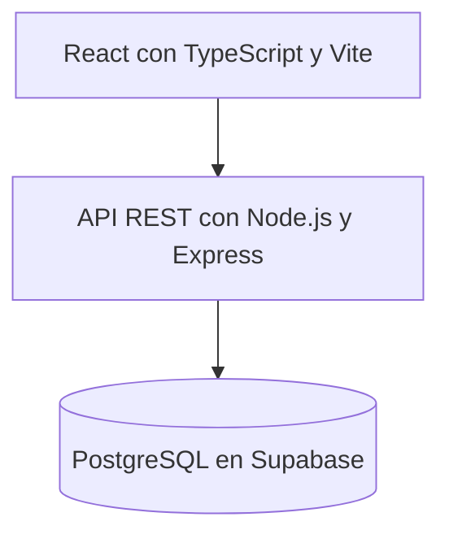

# Arquitectura y tecnologías

[Volver al índice de documentación](README.md)

La solución utilizará una arquitectura cliente-servidor:



- **Frontend:** formularios, tablas, filtros, detalle de comprobantes y presentación de reportes.
- **Backend:** validaciones, reglas de negocio, transacciones, consultas y exportación.
- **Base de datos:** persistencia, claves, restricciones, índices y vistas de apoyo.

El frontend se comunica con la API. Las credenciales privilegiadas de la base permanecen en el servidor y no se incluyen en archivos enviados al navegador. El MVP contempla un único operador sin módulos de autenticación, roles o auditoría; las condiciones de acceso al entorno se establecen en [RNF08](requisitos-no-funcionales.md#rnf08-protección-técnica-de-los-datos).

La selección de un análisis consiste en indicar **desde**, **hasta**, tipo de reporte y filtros adicionales. No se persisten entidades PeriodoAnalisis, Asiento o ConceptoContable. Los asientos 7 y 13 y el resumen de Ingresos Brutos se generan mediante consultas.

## Organización propuesta del backend

El backend utiliza Sequelize para representar las tablas y sus asociaciones. Para el MVP se propone el siguiente recorrido:

```text
routes → controllers → services → modelos Sequelize → PostgreSQL
```

| Componente | Responsabilidad |
|---|---|
| Rutas | Asociar direcciones y métodos HTTP con controladores. |
| Controladores | Interpretar la petición y devolver una respuesta HTTP. |
| Servicios | Aplicar reglas de negocio y coordinar operaciones y transacciones. |
| Modelos Sequelize | Representar tablas, asociaciones y operaciones de persistencia. |

La distribución se administra junto con el comprobante. Las confirmaciones y validaciones de notas se coordinan en un servicio y una misma transacción. No se exige una capa repository para esta etapa; puede incorporarse cuando las consultas complejas o repetidas justifiquen separarla.

Esta organización es una propuesta de implementación. El [diagrama de clases](diagramas/clases.md) describe responsabilidades conceptuales y no obliga a escribir todos los servicios como clases de JavaScript.
