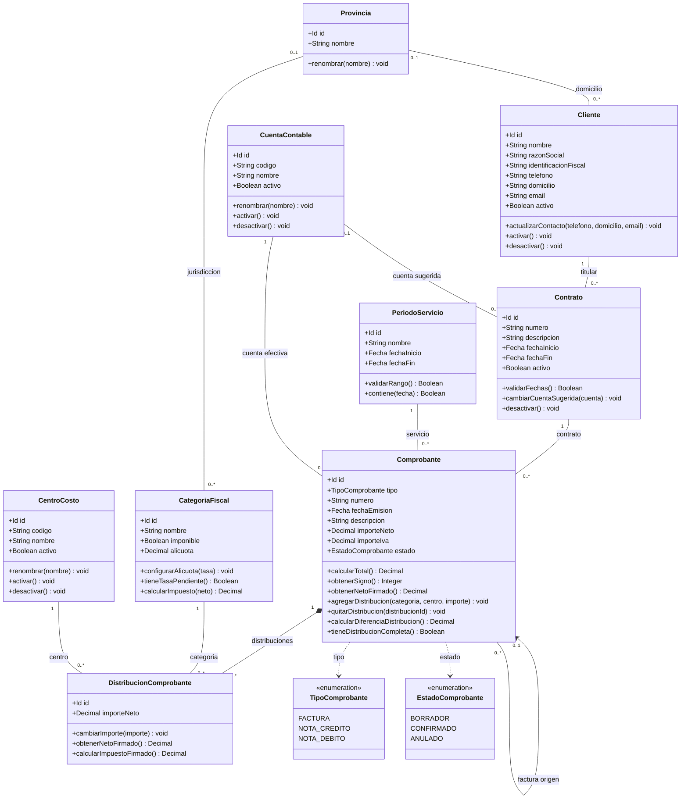
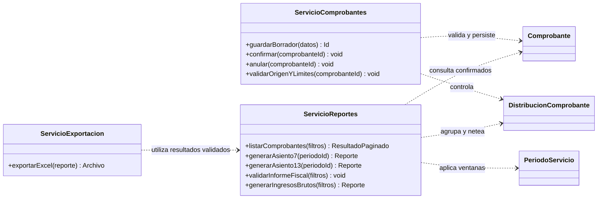

# Diagrama de clases

[Volver al índice de documentación](../README.md)

Propuesta de diseño orientado a objetos basada en el modelo del MVP. Define nueve clases de dominio, dos enumeraciones y servicios de aplicación. Es un diseño posible para organizar el backend; no representa clases que ya estén implementadas ni modifica el esquema de la base de datos.

Las asociaciones representan referencias a objetos. Por eso no se repiten como atributos los campos SQL `cliente_id`, `contrato_id`, `provincia_id` y las demás claves foráneas. El diagrama mantiene las once relaciones del modelo relacional.

## Clases del dominio

## Cómo interpretar el diagrama

- `1`: relación obligatoria con exactamente un objeto.
- `0..1`: relación opcional, con un máximo de un objeto.
- `0..*`: cero o muchos objetos relacionados.
- El rombo negro representa composición: una distribución pertenece a un único comprobante y se administra como parte de él. No indica que deba configurarse borrado en cascada en SQL; las claves foráneas existentes mantienen `ON DELETE RESTRICT`.
- Las líneas discontinuas indican dependencia de un tipo. Las enumeraciones no son tablas adicionales.
- `+` identifica miembros públicos en esta representación conceptual. Al implementar, conviene encapsular los cambios de estado e importes para que las asignaciones directas no eviten las validaciones.

`Id` representa un identificador compatible con `bigint` de PostgreSQL. En una API puede transportarse como texto para evitar pérdida de precisión en JavaScript. `Decimal` representa aritmética decimal exacta, no un `number` de coma flotante utilizado sin control. `Fecha` representa una fecha de negocio sin hora.

La opcionalidad de los atributos escalares se conserva según el diccionario de datos: los datos de contacto y razón social del cliente son opcionales, al igual que la identificación fiscal; el contrato admite descripción y fechas opcionales; la descripción del comprobante es opcional únicamente para una factura; la alícuota puede estar pendiente. Las asociaciones muestran por separado la opcionalidad de los vínculos.

## Responsabilidades y reglas

### Comprobante y sus distribuciones

`Comprobante` representa facturas, NC y ND mediante `TipoComprobante`. Para este MVP no se necesitan tres subclases: comparten atributos, estructura y persistencia; sus diferencias se expresan mediante reglas y el signo aplicado al consultar.

`calcularTotal()` devuelve neto más IVA y corresponde a la columna generada `importe_total`; no es un segundo importe editable. `obtenerSigno()` devuelve −1 para NC y +1 para factura o ND. Los valores almacenados son magnitudes no negativas y el neto debe ser mayor que cero al confirmar.

Cada `DistribucionComprobante` relaciona una categoría fiscal, un centro de costo y un importe neto positivo. La provincia se obtiene de la categoría; no se almacena una segunda provincia en la distribución. Sus métodos de importes firmados utilizan el tipo del comprobante propietario y la tasa de la categoría.

La suma de distribuciones debe igualar el neto al confirmar. Un borrador puede estar incompleto, por lo que la multiplicidad es `0..*`. Las operaciones para agregar, quitar o cambiar distribuciones solo se permiten sobre borradores en el circuito propuesto. La combinación categoría y centro no se repite dentro del comprobante.

### Factura de origen

La autorrelación `factura origen` indica que una factura puede recibir varias notas. Una FACTURA tiene origen nulo; una NC o ND requiere exactamente una factura de origen confirmada y un motivo. Para el MVP, la nota mantiene el mismo contrato y cuenta efectiva de esa factura.

El servicio de comprobantes verifica el tipo y estado del origen y los límites acumulados de crédito. Una nota no puede referirse a sí misma ni a otra nota. La multiplicidad opcional del diagrama se vuelve obligatoria para los dos tipos de nota mediante estas reglas.

### Categoría fiscal y provincia

Una categoría imponible exige provincia y una alícuota configurada para calcular el impuesto. `calcularImpuesto(neto)` aplica la tasa y redondea a dos decimales por distribución. Si la categoría es no imponible, devuelve cero; si es imponible y falta la tasa, informa un error de configuración en lugar de devolver cero.

Por ejemplo, una tasa de 5 % se almacena como `0.05`. El signo de una nota se aplica después del cálculo por fila. Las categorías no imponibles globales pueden no tener provincia.

`configurarAlicuota()` valida el intervalo de 0 a 1. El modelo conserva una tasa actual, sin historial: cambiarla modifica los resultados históricos recalculados. Tampoco debe permitirse cambiar silenciosamente la provincia o condición imponible de una categoría utilizada; ese cambio requiere evaluar su efecto histórico.

### Contrato y período de servicio

La cuenta del contrato es una sugerencia para nuevas cargas; la cuenta efectiva del comprobante se conserva de forma independiente. Cambiar la sugerencia no modifica documentos anteriores.

`PeriodoServicio.contiene(fecha)` es una consulta auxiliar sobre el intervalo, no una regla que obligue a emitir una factura dentro del período. La asignación del servicio es explícita y puede diferir del mes de emisión. No se agregan métodos de cierre porque esa función está fuera del MVP.

## Servicios de aplicación

Las clases de dominio representan información y comportamiento local. Las operaciones que consultan varios documentos, coordinan persistencia o generan archivos corresponden a servicios. Estas clases no crean tablas adicionales.

`datos` y `filtros` son objetos de entrada de la API. Los filtros pueden incluir fechas de emisión, estado, tipo, contrato, cuenta, período, provincia y centro según el reporte. `Reporte`, `ResultadoPaginado` y `Archivo` son resultados de aplicación; no son entidades persistidas. La paginación es necesaria para listados administrativos.

`ServicioComprobantes.confirmar()` verifica datos, distribución, origen y límites de NC dentro de una transacción. Los límites deben comprobarse con una estrategia de concurrencia que impida que dos solicitudes los superen. `anular()` comprueba las notas confirmadas vinculadas antes de anular una factura. Se omiten repositorios y controladores de este diagrama conceptual para mantenerlo centrado en el dominio; los servicios accederán a la persistencia mediante una capa de datos.

`ServicioReportes` utiliza únicamente confirmados para resultados definitivos y aplica el signo de NC y ND. Su listado administrativo puede mostrar otros estados. En el informe tributario controla distribuciones incompletas y tasas faltantes del intervalo antes de aplicar los filtros provinciales y por centro. `ServicioExportacion` recibe un reporte válido y conserva sus filtros y criterios de cálculo en el archivo.

Los asientos 7 y 13 seleccionan por período de servicio y fecha de emisión; el cálculo de Ingresos Brutos utiliza el intervalo calendario de emisión. Son consultas, por lo que no requieren clases persistentes `Asiento` ni `PeriodoAnalisis`.

## Correspondencia con la base de datos

| Clase de dominio | Tabla |
|---|---|
| Cliente | cliente |
| Contrato | contrato |
| PeriodoServicio | periodo_servicio |
| CuentaContable | cuenta_contable |
| Comprobante | comprobante |
| Provincia | provincia |
| CategoriaFiscal | categoria_fiscal |
| CentroCosto | centro_costo |
| DistribucionComprobante | distribucion_comprobante |

El [diccionario de datos](../base-de-datos.md) documenta campos y restricciones. El [archivo Mermaid](clases.mmd) permite editar el diagrama principal.
