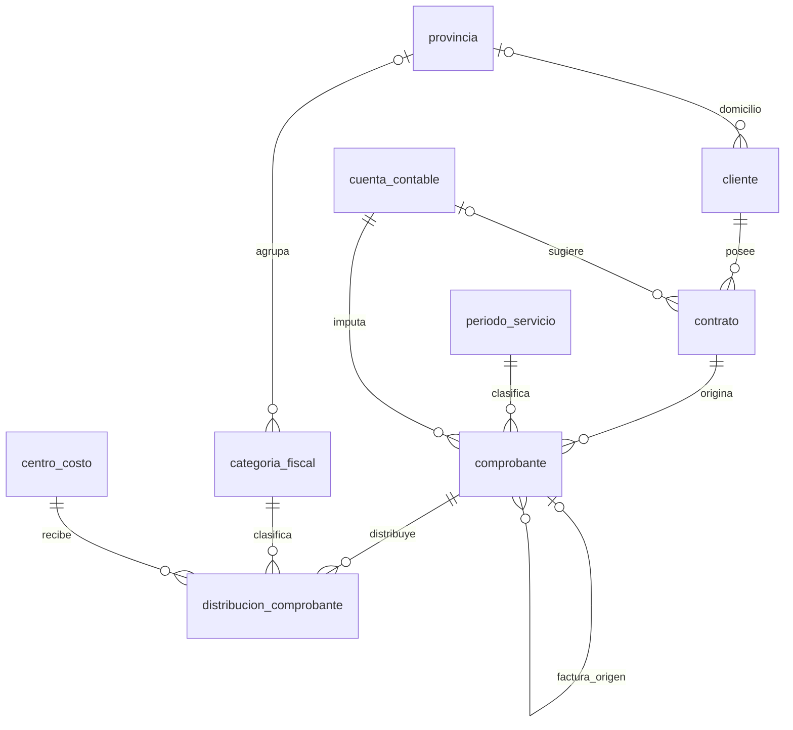

# Diagrama entidad-relación

[Volver al índice de documentación](../README.md)

El diagrama describe las nueve entidades persistidas y sus once relaciones. Los campos y restricciones se detallan en [Base de datos](../base-de-datos.md).

La opcionalidad representa las columnas del esquema. Una NC o ND exige factura de origen, una categoría imponible exige provincia y un comprobante confirmado exige al menos una distribución completa. Estas condiciones complementan las cardinalidades generales.
